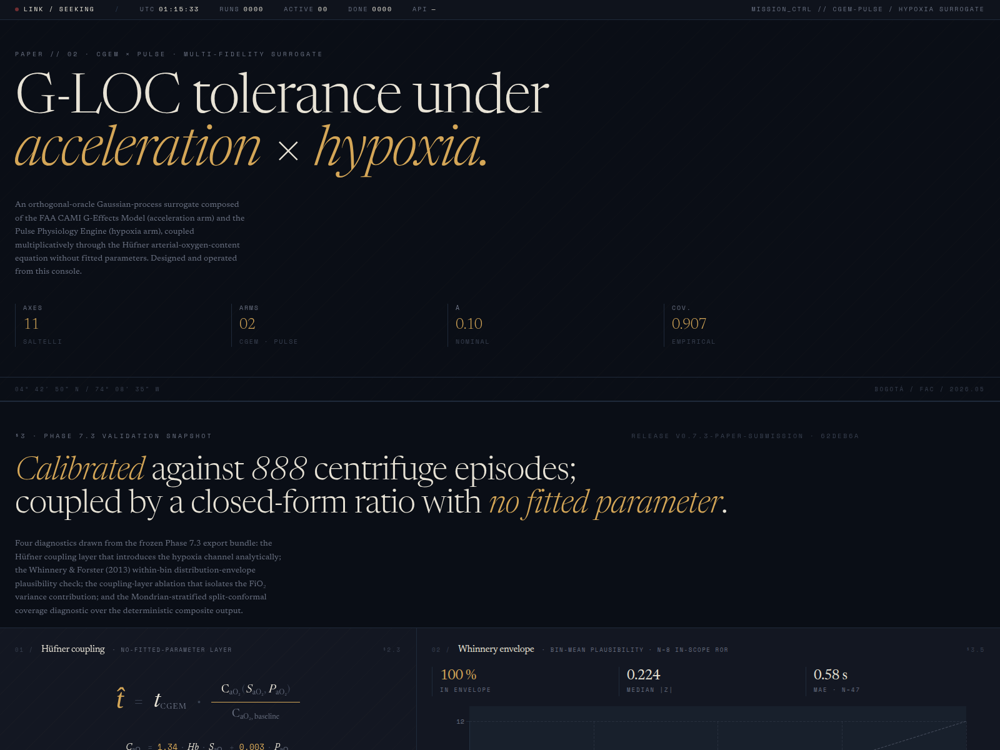
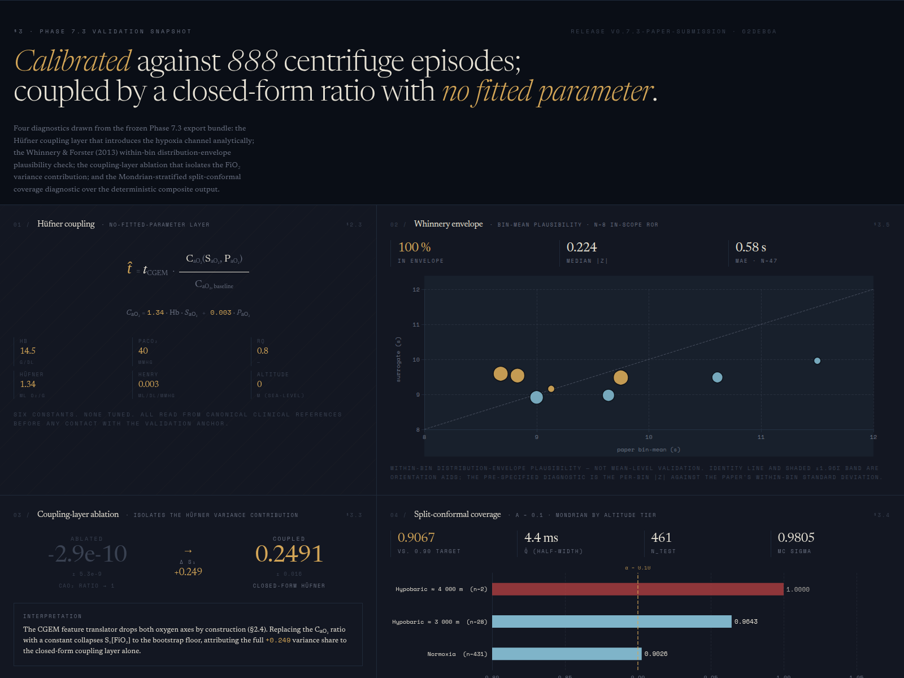
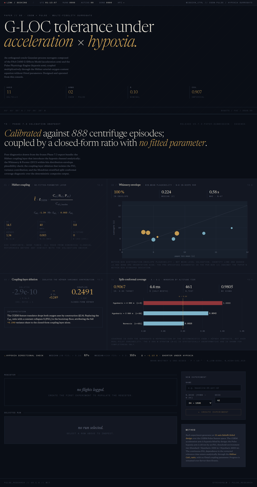
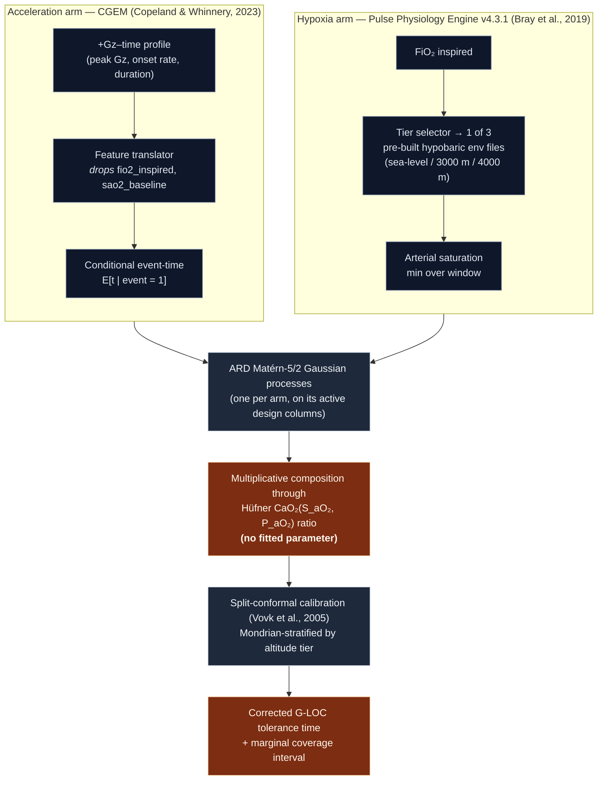

<div align="center">

# Pulse_Research

*An orthogonal-oracle Gaussian-process surrogate, coupled through a no-fitted-parameter arterial-oxygen-content equation, for rapid-onset +Gz-induced loss of consciousness under FiO₂-equivalent hypoxia.*

[](https://doi.org/10.5281/zenodo.20248871)
[](LICENSE)
[](https://www.python.org)
[](#scope-and-limitations)
[](https://doi.org/10.1186/2046-7648-2-19)

<br/>

<a href="docs/assets/dashboard-hero.png">
  
</a>

<sub><i>Mission-control console — instrumentation × editorial scientific typography.<br/>
Click for full resolution.</i></sub>

</div>

---

<details>
<summary><b>Table of contents</b></summary>

- [Overview](#overview)
- [Validation snapshot (Phase 7.3)](#validation-snapshot-phase-73)
- [Dashboard](#dashboard)
- [Architecture](#architecture)
- [Repository layout](#repository-layout)
- [Quick start](#quick-start)
- [Scope and limitations](#scope-and-limitations)
- [Key references](#key-references)
- [Citation](#citation)
- [Author](#author)
- [License](#license)

</details>

---

## Overview

Pulse_Research builds a quantitative tolerance surrogate for combined +Gz acceleration and reduced inspired-oxygen exposure — the convergence of stressors that occurs in high-altitude air-combat scenarios where cabin depressurisation or oxygen-system failure overlaps with sustained manoeuvring.

Two deterministic physiological simulators are composed:

- **CGEM** — the Civil Aerospace Medical Institute G-Effects Model (Copeland & Whinnery, 2023); a Fortran G-LOC simulator that returns the conditional time-to-event under prescribed +Gz–time profiles.
- **Pulse Physiology Engine v4.3.1** (Bray et al., 2019) — a cardiovascular–respiratory ODE simulator that resolves arterial and tissue oxygen delivery; driven here by an FiO₂-threshold environment-tier mapping (sea-level / hypobaric-3000 m / hypobaric-4000 m).

The two arms have disjoint active feature support — CGEM is hypoxia-blind by design; Pulse is acceleration-blind. The classical Kennedy & O'Hagan multi-fidelity construction does not apply. Instead, each arm is fit as an independent ARD Matérn-5/2 Gaussian-process surrogate on its active design columns, and the two posteriors are composed multiplicatively through the Hüfner arterial-oxygen-content ratio

```
                     C_aO₂ (S_aO₂, P_aO₂)
t_corrected = t_CGEM · ──────────────────────
                     C_aO₂, baseline

C_aO₂ = 1.34 · Hb · S_aO₂ + 0.003 · P_aO₂
```

Every constant in the coupling layer (Hüfner constant 1.34, Henry coefficient 0.003, Hb = 14.5 g/dL, P_aCO₂ = 40 mmHg, RQ = 0.8, altitude = 0 m) is read from canonical clinical references *before* any contact with the validation anchor.

> [!IMPORTANT]
> **No coupling parameter is fitted to data.** The Hüfner ratio is a closed-form identity drawn from clinical canon; the validation anchor — Whinnery & Forster (2013) — is touched only as a held-out test set.

## Validation snapshot (Phase 7.3)

Anchored on the Whinnery & Forster (2013) centrifuge corpus (888 G-LOC episodes in healthy humans; rapid-onset Tables 1 and 2, N = 406 and N = 432):

| Metric | Value | Source |
|---|---|---|
| Closed-form anchor MAE (n = 47 in-scope rows) | 0.58 s | `exports/whinnery_anchor.json` |
| Bin-mean predictions inside within-bin distributional envelope | 100 % (8 of 8) | `exports/whinnery_bins_anchor.json` |
| Median |z| per bin | 0.224 | (same) |
| S₁[FiO₂] (Hüfner-coupled) | 0.2491 | `exports/corrected_time_sobol.json` |
| S₁[FiO₂] (ablated; CaO₂ ratio → 1) | −2.9 × 10⁻¹⁰ | `exports/coupling_ablation_sobol.json` |
| Δ S₁[FiO₂] attributable to closed-form coupling | +0.249 | (ablation contrast) |
| Split-conformal marginal coverage (α = 0.10) | 0.9067 | `exports/split_conformal_coverage.json` |
| Conformal interval half-width | 0.0044 s | (same) |
| Directional check: median corrected time at FiO₂ < 0.16 | 8.9 s | `exports/whinnery_anchor.json` |
| Directional check: median corrected time at FiO₂ > 0.30 | 10.0 s | (same) |

Conformal coverage is over the surrogate's reproduction of the deterministic CGEM × Hüfner composite output — an emulator-calibration diagnostic, not a prediction interval on real-pilot variability.

<div align="center">
  <a href="docs/assets/dashboard-validation-lab.png">
    
  </a>
  <br/>
  <sub><i>Validation Lab section of the console — each panel binds to a JSON export under <code>exports/</code>.</i></sub>
</div>

## Dashboard

A single-page React 19 + Vite + ECharts console exposes the live Phase 7.3 snapshot. Every panel is bound to a JSON artefact written by the deterministic pipeline; the dashboard never re-computes a number from scratch.

<div align="center">
  <a href="docs/assets/dashboard-full-page.png">
    
  </a>
  <br/>
  <sub><i>Full-page composite — hero, Validation Lab, design-space, and Sobol tornado.</i></sub>
</div>

Launch the dashboard locally with `npm run dev` inside [`frontend/`](frontend/) (see [Quick start](#quick-start)). The Validation Lab page reads from a frozen Phase 7.3 snapshot and requires no backend.

## Architecture



## Repository layout

```
src/pulse_research/      # Python package
  api/                   # CGEM glue, Pulse glue, FastAPI app, runners
  orchestration/         # common utilities (paired-parquet split, random_split)
  schema/                # FeatureVector typed wrappers
  sensitivity/           # Saltelli design, analyzer, st_stability, strata
scripts/                 # one-shot deterministic drivers
  run_phase7_1b.py       # paired CGEM + Pulse design execution
  run_phase7_2.py        # GP refit (orthogonal-oracle pattern)
  run_phase7_3.py        # Sobol, conformal, WF2013 anchors, directional check
  audit_run_records.py   # byte-level parquet manifest audit (CI guard)
  rebuild_phase7_1b_cgem_arm.py
  run_paired_smoke.py
tests/                   # pytest suite
frontend/                # React 19 + Vite + ECharts + Tailwind v4 console
  src/components/        # MissionControl, Hero, ExperimentsTable,
                         # DesignSpacePlot, SobolTornadoPanel,
                         # ShapBarPanel, ValidationLab, …
  src/data/              # static Phase 7.3 snapshot for ValidationLab
data/external/           # Whinnery & Forster (2013) bin table (publishable)
```

## Quick start

### Python environment

```bash
python3 -m venv .venv
source .venv/bin/activate
pip install -e ".[dev]"
pytest tests/ -v
```

### Reproducible pipeline

The full analytical pipeline — Saltelli sampling, paired CGEM and Pulse execution, Gaussian-process refit, Sobol decomposition, coupling-layer ablation, split-conformal calibration, and the Whinnery & Forster (2013) anchoring — is exposed through a single deterministic driver:

```bash
python scripts/run_phase7_3.py --seed 42 --out-dir exports/
```

Invoked with `seed = 42` and no other flags, the driver produces byte-identical export artefacts against the canonical snapshot. SHA-256 manifests on every parquet row and a continuous-integration audit script (`scripts/audit_run_records.py`) refuse to ship a release whose hashes drift from the recorded values.

### Frontend dashboard

```bash
cd frontend
npm install
npm run dev              # http://localhost:5173, proxies /api → :8000
```

The frontend exposes a single-page console with live experiment status (SSE), parallel-coordinates design-space plot, Sobol tornado, SHAP-style bar diagnostics, and a Validation Lab section that visualises the Phase 7.3 snapshot (Hüfner coupling typography, Whinnery envelope, coupling-layer ablation, Mondrian conformal coverage) directly from the static snapshot — no backend required.

### Backend (optional, for the live console)

```bash
source .venv/bin/activate
uvicorn pulse_research.api.app:create_app --factory --reload
```

The FastAPI app exposes experiment lifecycle endpoints, an SSE event stream, and `/api/sobol/{experiment_id}` for the tornado panel.

## Scope and limitations

Validation and headline claims are scoped to the **rapid-onset regime** defined by peak +Gz ≥ 4.7 G and onset rate ≥ 1.0 G/s. Gradual-onset profiles, peak +Gz ≥ 9 G, and severe hypobaric exposures beyond the mild-hypobaric tier are out of scope. The CGEM regressor used by the acceleration arm is trained predominantly on rapid-onset centrifuge profiles and does not extrapolate well to gradual-onset induction times.

All training and Saltelli evaluation is synthetic. The real-human anchor is the Whinnery & Forster (2013) archival aggregate dataset (PMC3710154); the Hüfner coupling is independently consistent with the Besch et al. (1994) hypoxia/+Gz primary observation. No individual-subject data were accessed.

Pulse Physiology Engine v4.3.1's published validation envelope covers resting and moderate-exercise scenarios. Following the synthetic-only training precedent of Achermann et al. (2024), Pulse is framed here as a parametric simulator ensemble providing mechanistic resolution on the hypoxia channel, not as an independent G-LOC predictor.

The continuous FiO₂ dependence in the corrected-time surface enters analytically through the closed-form Hüfner / alveolar-gas coupling; the Pulse arm itself is driven by a tier-categorical FiO₂→environment mapping. A continuous-gas-fraction Pulse refinement is left to follow-on work.

## Key references

- Achermann F, Stastny T, Danciu B, Kolobov A, Chung JJ, Siegwart R, et al. WindSeer: real-time volumetric wind prediction over complex terrain aboard a small uncrewed aerial vehicle. *Nat Commun.* 2024;15(1):3507. [doi:10.1038/s41467-024-47778-4](https://doi.org/10.1038/s41467-024-47778-4)
- Besch EL, Werchan PM, Wiegman JF, Nesthus TE, Shahed AR. Effect of hypoxia and hyperoxia on human +Gz duration tolerance. *J Appl Physiol.* 1994;76(4):1693–1700. [doi:10.1152/jappl.1994.76.4.1693](https://doi.org/10.1152/jappl.1994.76.4.1693)
- Bray A, Webb JB, Enquobahrie A, Vicory J, Heneghan J, Hubal R, et al. Pulse Physiology Engine: an open-source software platform for computational modeling of human medical simulation. *SN Compr Clin Med.* 2019;1(5):362–377. [doi:10.1007/s42399-019-00053-w](https://doi.org/10.1007/s42399-019-00053-w)
- Copeland K, Whinnery JE. Cerebral blood flow based computer modeling of Gz-induced effects. *Aerosp Med Hum Perform.* 2023;94(5):409–414. [doi:10.3357/AMHP.6179.2023](https://doi.org/10.3357/AMHP.6179.2023)
- Saltelli A, Annoni P, Azzini I, Campolongo F, Ratto M, Tarantola S. Variance based sensitivity analysis of model output. *Comput Phys Commun.* 2010;181(2):259–270. [doi:10.1016/j.cpc.2009.09.018](https://doi.org/10.1016/j.cpc.2009.09.018)
- Vovk V, Gammerman A, Shafer G. *Algorithmic Learning in a Random World.* Springer; 2005.
- Whinnery JE, Forster EM. The +Gz-induced loss of consciousness curve. *Extrem Physiol Med.* 2013;2(1):19. [doi:10.1186/2046-7648-2-19](https://doi.org/10.1186/2046-7648-2-19)

## Citation

If you use this software in your research, please cite the archived release:

> Malpica D. *Pulse_Research: an orthogonal-oracle Gaussian-process surrogate for +Gz × hypoxia G-LOC tolerance* (Version 0.1.0) [Computer software]. Zenodo; 2026. [doi:10.5281/zenodo.20248871](https://doi.org/10.5281/zenodo.20248871)

<details>
<summary>BibTeX</summary>

```bibtex
@software{malpica_pulse_research_2026,
  author    = {Malpica, Diego},
  title     = {Pulse\_Research: an orthogonal-oracle Gaussian-process surrogate
               for +Gz $\times$ hypoxia G-LOC tolerance},
  version   = {0.1.0},
  year      = {2026},
  publisher = {Zenodo},
  doi       = {10.5281/zenodo.20248871},
  url       = {https://doi.org/10.5281/zenodo.20248871}
}
```

</details>

A machine-readable [`CITATION.cff`](CITATION.cff) is included at the repository root — GitHub's "Cite this repository" widget reads it automatically.

## Author

**Dr. Diego Malpica, MD** — Dirección de Medicina Aeroespacial, Fuerza Aérea Colombiana, Bogotá, Colombia. Aerospace medicine physician, researcher, pilot.

[github.com/strikerdlm](https://github.com/strikerdlm) · <dlmalpica@me.com>

## License

[MIT](LICENSE). Copyright © 2026 Diego Malpica, MD.
